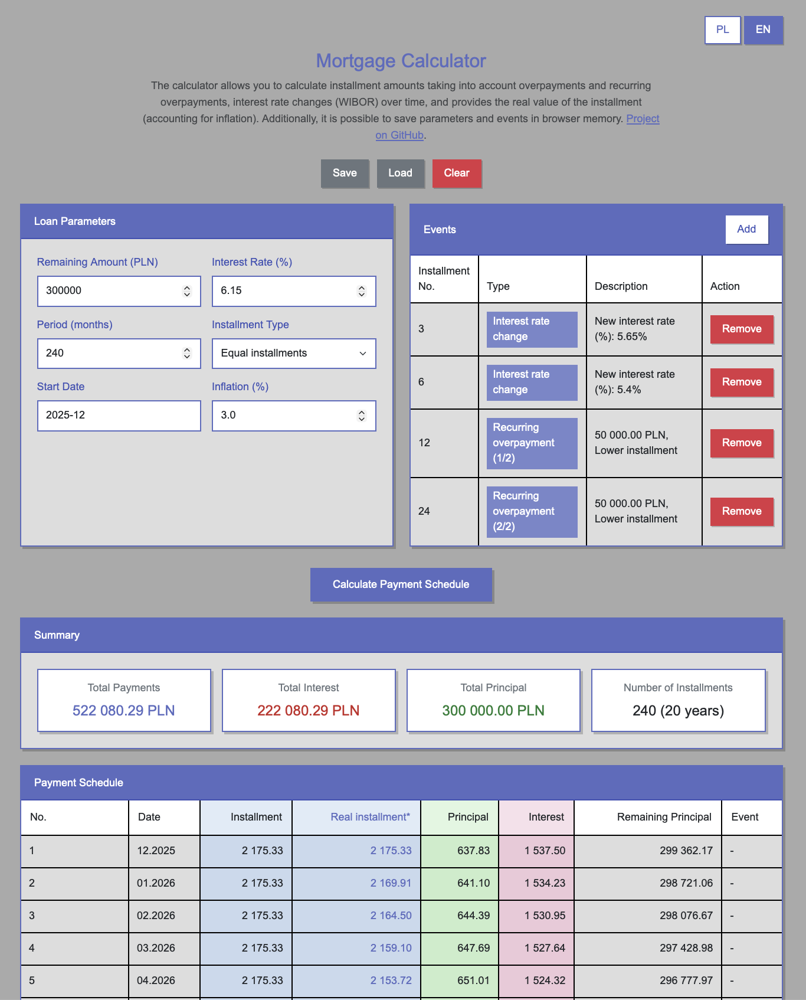

# Mortgage Calculator


A simple yet advanced mortgage calculator created for fun with [Claude Code](https://claude.com/claude-code).

**🌐 Live Demo:** [https://hipoteka.kurczyk.xyz](https://hipoteka.kurczyk.xyz)

**📌 Note:** Originally designed for Polish mortgages, but should work with any mortgage type.

## Why this project?

I couldn't find a similar calculator that would allow easy simulation of:
- One-time and recurring overpayments
- Interest rate changes (WIBOR) over time
- Real installment values accounting for inflation
- Payment holidays
- Changes in installment count

## Features

- ✅ **Equal and decreasing installments** - choice of loan repayment type
- ✅ **Overpayments** - one-time and recurring with strategy selection (shorten period or lower installment)
- ✅ **Interest rate changes** - simulate WIBOR changes in specific months
- ✅ **Inflation** - calculate real installment values accounting for inflation
- ✅ **Payment holidays** - ability to plan interest-only payment periods
- ✅ **Save simulations** - parameters and events saved in browser's localStorage
- ✅ **Bilingual** - interface in Polish and English (English by default)
- ✅ **Responsive design** - works on desktop and mobile devices
- ✅ **Clean design** - light indigo color scheme with Arial font

## How to use

1. Open `index.html` in your browser
2. Fill in basic loan parameters
3. Add expected events (overpayments, interest rate changes, etc.)
4. Click "Calculate Payment Schedule"
5. Optionally save the simulation for later use

## Development

### Prerequisites

- Node.js 18+ and npm

### Setup

```bash
# Install dependencies
npm install

# Install Playwright browsers (for E2E tests)
npx playwright install
```

### Running Tests

```bash
# Run all tests (unit + E2E)
npm test

# Run only unit tests
npm run test:unit

# Run unit tests in watch mode
npm run test:unit:watch

# Run unit tests with coverage
npm run test:unit:coverage

# Run only E2E tests
npm run test:e2e

# Run E2E tests in UI mode
npm run test:e2e:ui

# Run E2E tests in headed mode (see browser)
npm run test:e2e:headed

# Debug E2E tests
npm run test:e2e:debug
```

### Test Coverage

The project includes comprehensive test coverage:
- **Unit Tests**: Test calculation functions, event handling, utilities, storage, and internationalization
- **E2E Tests**: Test complete user workflows in real browsers (Chrome, Firefox, Safari)

Coverage goals:
- Lines: 40%+
- Functions: 45%+
- Branches: 30%+
- Statements: 40%+

### CI/CD

Tests run automatically on every push and pull request via GitHub Actions. The workflow includes:
- Unit tests with coverage reporting
- E2E tests across multiple browsers
- Automatic artifact upload on failures

## Technologies

- HTML5
- CSS3 (Bootstrap 5.3.0)
- Vanilla JavaScript

## Project structure

```
mortgage_calculator/
├── index.html          # Main HTML file
├── script.js           # Calculator logic and i18n
├── styles.css          # Styling (light indigo theme)
├── .gitignore          # Git ignore file
└── README.md           # This file
```

## Screenshot



## License

This project is available under the MIT License.

## Author

Created by **Aleksander Kurczyk** using [Claude Code](https://claude.com/claude-code) - AI programming tool from Anthropic.

---

💡 **Tip**: Feel free to modify the code and adapt the calculator to your needs!
